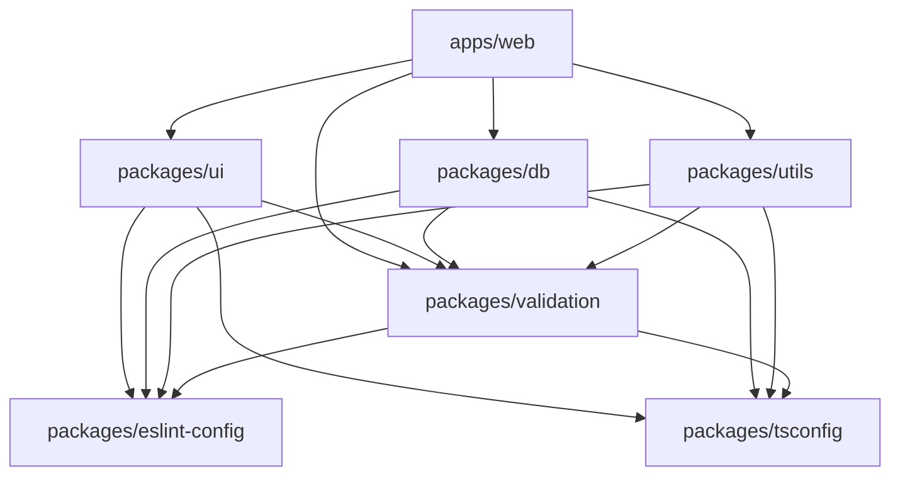

# 아키텍처 가이드

## 모노레포 구조

이 프로젝트는 Turborepo를 사용한 모노레포 구조로 설계되었습니다.

### 디렉토리 구조

```
project/
├── apps/
│   └── web/                    # Next.js 웹 애플리케이션
│       ├── src/
│       │   ├── app/           # App Router 페이지
│       │   ├── components/    # 페이지별 컴포넌트
│       │   └── lib/          # 앱별 유틸리티
│       ├── public/           # 정적 파일
│       └── package.json
│
├── packages/
│   ├── ui/                    # 공유 UI 컴포넌트
│   │   ├── src/
│   │   │   ├── components/   # Radix UI 기반 컴포넌트
│   │   │   └── lib/         # UI 유틸리티
│   │   └── index.ts         # 메인 export
│   │
│   ├── db/                   # 데이터베이스 레이어
│   │   ├── prisma/          # Prisma 스키마
│   │   ├── src/             # DB 클라이언트
│   │   └── index.ts
│   │
│   ├── utils/               # 공통 유틸리티
│   │   ├── src/
│   │   │   └── lib/        # 유틸리티 함수들
│   │   └── index.ts
│   │
│   ├── validation/          # 데이터 검증
│   │   ├── src/
│   │   │   └── schemas/    # Zod 스키마들
│   │   └── index.ts
│   │
│   ├── eslint-config/       # ESLint 설정
│   │   ├── index.js        # 기본 설정
│   │   ├── next.js         # Next.js 설정
│   │   ├── library.js      # 라이브러리 설정
│   │   └── react-internal.js # React 컴포넌트 설정
│   │
│   └── tsconfig/           # TypeScript 설정
│       ├── base.json       # 기본 설정
│       ├── nextjs.json     # Next.js 설정
│       └── react-library.json # React 라이브러리 설정
│
├── scripts/                # 개발 스크립트
├── .github/workflows/      # CI/CD 워크플로우
└── package.json           # 루트 패키지 설정
```

## 패키지 의존성 그래프



## 설계 원칙

### 1. 단방향 의존성

- 상위 레벨 패키지는 하위 레벨 패키지에 의존
- 순환 의존성 방지
- 명확한 계층 구조 유지

### 2. 관심사 분리

- **UI**: 재사용 가능한 컴포넌트
- **DB**: 데이터 액세스 레이어
- **Utils**: 비즈니스 로직과 무관한 유틸리티
- **Validation**: 데이터 검증 로직

### 3. 타입 안전성

- 모든 패키지에서 TypeScript 사용
- 엄격한 타입 체크 설정
- 자동 타입 추론 활용

### 4. 개발자 경험

- 일관된 개발 도구 설정
- 자동화된 코드 품질 검사
- 명확한 문서화

## 빌드 전략

### Turborepo 캐싱

- 변경되지 않은 패키지는 캐시에서 결과 재사용
- 의존성 그래프 기반 병렬 빌드
- 원격 캐시 지원 (선택사항)

### 빌드 순서

1. `packages/tsconfig`, `packages/eslint-config` (설정 패키지)
2. `packages/validation` (기본 스키마)
3. `packages/utils`, `packages/db` (유틸리티 레이어)
4. `packages/ui` (컴포넌트 레이어)
5. `apps/web` (애플리케이션)

## 배포 전략

### 개발 환경

- 모든 패키지를 개발 모드로 실행
- Hot reload 지원
- 실시간 타입 체크

### 프로덕션 환경

- 각 패키지를 개별적으로 빌드
- 최적화된 번들 생성
- 정적 파일 최적화

## 확장 가이드

### 새 패키지 추가

1. `packages/` 하위에 새 디렉토리 생성
2. `package.json` 설정 (네이밍: `@repo/package-name`)
3. TypeScript, ESLint 설정 추가
4. `pnpm-workspace.yaml`에 자동 포함됨

### 새 앱 추가

1. `apps/` 하위에 새 디렉토리 생성
2. 필요한 패키지 의존성 추가
3. Turborepo 설정 업데이트

## 성능 최적화

### 번들 크기 최적화

- Tree shaking 활용
- 동적 import 사용
- 불필요한 의존성 제거

### 빌드 시간 최적화

- Turborepo 캐싱 활용
- 병렬 빌드 실행
- 증분 빌드 지원
